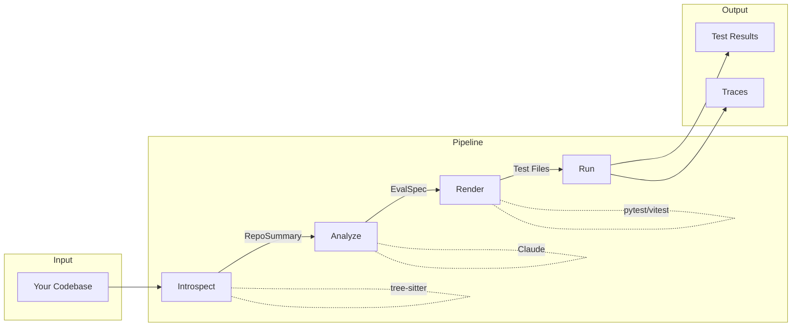

# evaluclaude

> **Zero-to-evals in one command.** Claude analyzes your codebase and generates functional tests.




A CLI tool that uses Claude to understand your codebase and generate real, runnable functional tests. Tree-sitter parses your code structure, Claude generates test specs, and deterministic renderers create the actual tests.

## Quick Start

```bash
npm install -g evaluclaude-harness
export ANTHROPIC_API_KEY=your-key

# Run the full pipeline
evaluclaude pipeline .

# Or step by step
evaluclaude intro .                    # Parse codebase
evaluclaude analyze . -o spec.json -i  # Generate spec (interactive)
evaluclaude render spec.json           # Create test files
evaluclaude run                        # Execute tests
```

## Commands

| Command                    | Description                                   |
| :------------------------- | :-------------------------------------------- |
| `pipeline [path]`          | Run full pipeline: intro -> analyze -> render -> run |
| `intro [path]`             | Introspect codebase with tree-sitter          |
| `analyze [path]`           | Generate EvalSpec with Claude                 |
| `render <spec>`            | Render EvalSpec to test files                 |
| `run [test-dir]`           | Execute tests and collect results             |
| `grade <input>`            | Grade output using LLM rubric                 |
| `rubrics`                  | List available rubrics                        |
| `calibrate`                | Calibrate rubric against examples             |
| `view [trace-id]`          | View trace details                            |
| `traces`                   | List all traces                               |
| `ui`                       | Launch Promptfoo dashboard                    |
| `eval`                     | Run Promptfoo evaluations                     |

## Supported Languages

| Language      | Parser                   | Test Framework  |
| :------------ | :----------------------- | :-------------- |
| Python        | tree-sitter-python       | pytest          |
| TypeScript    | tree-sitter-typescript   | vitest, jest    |
| JavaScript    | tree-sitter-typescript   | vitest, jest    |

## Output Structure

```
.evaluclaude/
  spec.json              # Generated EvalSpec
  traces/                # Execution traces
  results/               # Test results
  promptfooconfig.yaml   # Promptfoo config
```

## How This Was Built

This project was built in a few hours using [Amp Code](https://ampcode.com). You can explore the development threads:

- [Initial setup and CLI structure](https://ampcode.com/threads/T-019bae58-69c2-74d0-a975-4be84c7d98dc)
- [Introspection and tree-sitter integration](https://ampcode.com/threads/T-019bafc5-0d57-702a-a407-44b9b884b9d0)
- [EvalSpec analysis with Claude](https://ampcode.com/threads/T-019baf57-7bc1-7368-9e3d-d649da47b68b)
- [Test rendering and framework support](https://ampcode.com/threads/T-019baeef-6079-70d6-9c4a-3cfd439190f1)
- [Grading and rubrics system](https://ampcode.com/threads/T-019baf12-e566-733d-b086-d099880c77c1)
- [Promptfoo integration](https://ampcode.com/threads/T-019baf43-abcf-7715-8a65-0f5ac5df87ce)
- [UI polish and final touches](https://ampcode.com/threads/T-019baf63-8c9e-7018-b8bc-538c5a3cada7)

## Development

```bash
npm run build      # Build
npm run dev        # Dev mode
npm test           # Run tests
npm run typecheck  # Type check
```

## License

MIT
